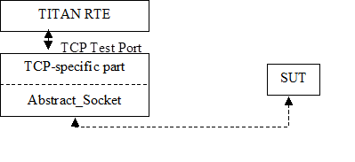

= TCP Socket Test Port for TTCN-3 Toolset with TITAN, Function Specification
:author: József Gyürüsi
:revnumber: 155 17-CNL 113 347, Rev. E
:revdate: 2009-03-16
:toc:

== How to Read This Document

This is the Function Specification for the TCP test port. The TCP test port is developed for the TTCN-3 Toolset with TITAN according to the Requirement Specification <<_4, [4]>>.

== Scope

The purpose of this document is to specify the functionality of the TCP test port. The document is primarily addressed to the end users of the product. Basic knowledge of TTCN-3 and TITAN TTCN-3 Test Executor is valuable when reading this document (see <<_1, [1]>> and <<_2, [2]>>).

This document is based on specifications of Transfer Control Protocol (TCP) defined by RFC 793 <<_5, [5]>>.

= General

The TCP Test Port makes it possible to execute test suites towards an SUT. The test port offers TCP primitives to the test suite and communicates with the SUT.

The communication between the TCP test port and the TITAN RTE is done by using the API functions described in <<_2, [2]>>. The TCP test port then transfers the TCP messages to the SUT.

See the overview of the system below:

= Function Specification

== Implementation

The TCP layer is implemented in the kernel of the operating system. The test port implements the communication between the TCP socket and the TTCN-3 TCP ASPs. When connecting to an SSL enabled IUT, the connection is secured with the OpenSSL toolkit based on configuration data. The test port can work in three modes:

* Using connection ASPs - both servers maintaining one listen port at a time and client maintaining any number of connections can be handled

* As a client - maintaining only one connection at a time

* As a server - maintaining several connections at the same time

The TCP test port supports IPv4 and IPv6.

=== Module Structure

The TCP test port is implemented in the following TTCN-3 blocks:

* __TCPasp_Types.ttcn__
* __TCPasp_PortType.ttcn__

The file __TCPasp_Types.ttcn__ defines the TCP ASPs. The port type is defined in __TCPasp_PortType.ttcn__.

The C++ implementation of the test port is contained in the following files:

* __TCPasp_PT.hh__
* __TCPasp_PT.cc__

The port is using the `Abstract_Socket`, a common component with the product number CNL 113 384, implementing the basic sending, receiving and socket handling routines. The following files should be included in the _Makefile_:

* __Abstract_Socket.hh__
* __Abstract_Socket.cc__

== Configuration

The configuration of the TCP test port is done by the TITAN RTE configuration file. If using the connection ASPs, the `use_connection_ASPs` parameter has to be set to `_"yes"_`. In this case sending the `ASP_TCP_Connect` ASP to the port creates connections, and sending the `ASP_TCP_Listen` ASP activates listening port. There are ASPs provided to receive the result of opening connections and listening ports, notification when a new client connects to the port, close specific connection and close the listening port.

If not using the connection ASPs, the address and port of the server and the operation mode have to be given as port parameters. The nagling algorithm can also be turned on and off from the port parameters. When the operation mode is set to client, the port will operate as TCP client socket, trying to connect to the given address and port. In case of server operation mode, the port will start a TCP server on the given port and will be listening for new connections from client ports. Using the SSL in the test port is also configurable. In case of using SSL some parameters can also be provided. For more information about configuring the test port please refer to <<_4, [4]>>.

== Start Procedure

=== Server Start, Listening to Incoming Connections

If not using connection ASPs, when the executable test suite is started, it initializes the TCP socket. After mapping, the TCP server type port is already listening for server connections.

If connection ASPs are used, an ``ASP_TCP_Listen'' has to be sent to the port with the listening port number and optionally the listening host name or address. The port will send back an ``ASP_TCP_Listen_result'' ASP filled with the result of the operation.

=== Client Start, Connecting to Remote TCP Ports

If not using connection ASPs, the TCP connection is initiated by the client type port, and is set up during the TTCN port mapping procedure. Before running the test case the user has to make sure that the target system is up and running. After the port is mapped and the connection has been set up, transmission of the ASPs can begin.

If connection ASPs are used, an `ASP_TCP_Connect` has to be sent to the port with the remote host name and port number where to connect. Optionally the local host name or address and port can be specified, if you want to connect to the remote host from a specific local interface. The port will send back an `ASP_TCP_Connect_result` ASP filled with the result of the operation.

[[sending-receiving-tcp-asps]]
== Sending/Receiving TCP ASPs

When the communication between the TCP test port and the target system is set up, the test port starts translating the TCP primitives to TCP packets (and vice versa) between the TITAN RTE and the SUT. The service primitives contains a `data` field of type octetstring which contains the user data, and beside this contains also contains a `client_id` of type integer which identifies the sending or receiving client, when the port is used in server operation mode or connection ASPs are used. When not using the connection ASPs, and the port is used in client mode or in server mode with only one single client, the `client_id` can be simply ignored.

== Closing Down

If connection ASPs are used, `ASP_TCP_Close` can be used to initiate the closing of connection(s). The same `ASP_TCP_Close` ASP identifying a client is received by TTCN indicating if a connection has been closed by the remote side.

After the test port has executed all test cases it will stop automatically. It will close down the TCP socket towards the SUT and terminate.

The execution of the test suite can be stopped at any time by pressing `<Ctrl>-c`. Even when execution is interrupted with `<Ctrl>-c` the socket is still closed.

== Changing the Address Family

The address family used by `ASP_TCP_Connect` and `ASP_TCP_Listen` can be changed during runtime with the help of the `ASP_TCP_SetAddressFamily` message. With this ASP the address family can be set to IPv4, IPv6 or unspecified, meaning that the address family will be determined from the actual addresses in the `ASP_TCP_Connect` and `ASP_TCP_Listen` ASPs. The address family can also be set from the configuration file.

== Logging

The type of information that will be logged can be categorized into two groups. The first one consists of information that shows the flow of the internal execution of the test port, for example, important events, which function that is currently executing etc. The second group deals with presenting valuable data, for example, presenting the content of a PDU. The logging printouts will be directed to the RTE log file. The user is able to decide whether logging is to take place or not by setting appropriate configuration data.

== Error Handling

Erroneous behavior detected during runtime is shown on the console and directed into the RTE log file. The following two types of messages are taken care of:

* Errors: +
information about errors detected is provided. If an error occurs the execution will stop immediately.
* Warnings: +
information about warnings detected is provided. The execution continues after the warning is shown.

== SSL Functionality

The test port can use SSL or TCP as the transport channel. The SSL implementation is based on the same OpenSSL as TITAN (OpenSSL 0.9.7d).

The protocols SSLv2, SSLv3 and TLSv1 are supported.

=== Compilation

The usage of SSL and even the compilation of the SSL related code parts are optional. This is because SSL related code parts cannot be compiled without the OpenSSL installed.

The compilation of SSL related code parts can be disabled by not defining the `AS_USE_SSL` macro in the _Makefile_ during the compilation. If the macro is defined in the _Makefile_, the SSL code parts are compiled to the executable test code. The usage of the SSL then can be enabled/disabled in the runtime configuration file, see <<_2, [2]>>. Naturally the test port parameter will be ignored if the `AS_USE_SSL` macro is not defined during compilation. For more information about the compilation see <<_3, [3]>>.

=== Authentication

The test port provides both server side and client side authentication. When authenticating the other side, a certificate is requested and the own trusted certificate authorities’ list is sent. The received certificate is verified whether it is a valid certificate or not (the public and private keys are matching). No further authentication is performed (e.g. whether hostname is present in the certificate). The verification can be enabled/disabled in the runtime configuration file, see <<_3, [3]>>.

In server mode the test port will always send its certificate and trusted certificate authorities’ list to its clients. If verification is enabled in the runtime configuration file, the server will request for a client’s certificate. If the client does not send a valid certificate, the connection will be refused. If verification is disabled, then the connection will be accepted even if the client does not send or send an invalid certificate.

In client mode the test port will send its certificate to the server on the server’s request. If verification is enabled in the runtime configuration file, the client will send its own trusted certificate authorities’ list to the server and will verify the server’s certificate as well. If the server’s certificate is not valid, the SSL connection will not be established. If verification is disabled, then the connection will be accepted even if the server does not send or send an invalid certificate.

The own certificate(s), the own private key file, the optional password protecting the own private key file and the trusted certificate authorities’ list file can be specified in the runtime configuration file, see <<_3, [3]>>.

The test port will check the consistency between the own private key and the public key (based on the own certificate) automatically. If the check fails, a warning is issued and execution continues.

=== Other Features

Both client and server support SSLv2, SSLv3 and TLSv1, however no restriction is possible to use only a subset of these. The used protocol will be selected during the SSL handshake automatically.

The usage of SSL session resumption can be enabled/disabled in the runtime configuration file, see <<_3, [3]>>.

The allowed ciphering suites can be restricted in the runtime configuration file, see <<_3, [3]>>.

The SSL `rehandshaking` requests are accepted and processed, however `rehandshaking` cannot be initiated from the test port.

=== Limitations

* No restriction is possible on the used protocols (e.g. use only SSLv2), it is determined during SSL handshake between the peers.
* SSL rehandshaking cannot be initiated from the test port.
* The own certificate file(s), the own private key file and the trusted certificate authorities’ list file must be in PEM format. Other formats are not supported.
* The SSL certificate verification works separately based on the `server_mode` test port parameter. When using the connection ASPs, and `server_mode` = `_"yes"_`, the test port will do the server authentication. If `server_mode` = `_"no"_` (or not specified), the test port will do the client-side certificate validation if the `ssl_verify_certificate` is also set to `_"yes"_`.

= Terminology

* *Sockets:* +
The sockets is a method for communication between a client program and a server program in a network. A socket is defined as "the endpoint in a connection. Sockets are created and used with a set of programming requests or "function calls" sometimes called the sockets application-programming interface (API). The most common socket API is the Berkeley UNIX C language interface for sockets. Sockets can also be used for communication between processes within the same computer.

* *OpenSSL:* +
The OpenSSL Project is a collaborative effort to develop a robust, commercial-grade, full-featured, and open source toolkit implementing the Secure Socket Layer (SSL v2/v3) and Transport Layer Security (TLS v1) protocols as well as a full-strength general-purpose cryptography library. For more information on the OpenSSL project see <<_7, [7]>>.

= Abbreviations

API:: Application Program Interface

ASP:: Abstract Service Primitive

RTE:: Run-Time Environment

SSL:: Secure Socket Layer

SUT:: System Under Test

TTCN-3:: Testing and Test Control Notation version 3

TCP:: Transmission Control Protocol

= References

[[_1]]
[1] ETSI ES 201 873-1 (2002) +
The Testing and Test Control Notation version 3. Part 1: Core Language

[[_2]]
[2] User Documentation for the TITAN TTCN-3 Test Executor

[[_3]]
[3] TCP Socket Test Port for TTCN-3 Toolset with TITAN, User’s Guide

[[_4]]
[4] Functional Test System Requirement Specification for GSN

[[_5]]
[5] https://tools.ietf.org/html/rfc793[RFC 793] (1981) +
Transmission Control Protocol

[[_6]]
[6] OpenSSL toolkit +
http://www.openssl.org

[[_7]]
[7] Hickman, Kipp, "The SSL Protocol", Netscape Communications Corp., Feb 9, 1995.

[[_8]]
[8] A. Frier, P. Karlton, and P. Kocher, "The SSL 3.0 Protocol", Netscape Communications Corp., Nov 18, 1996.

[[_9]]
[9] https://tools.ietf.org/html/rfc2246[RFC 2246] (1999), T. Dierks, C. Allen: "The TLS Protocol Version 1.0"
