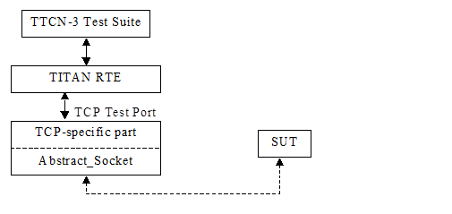
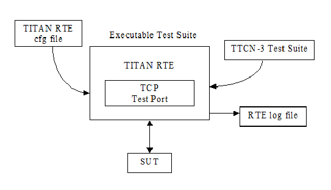

= TCP Socket Test Port for TTCN-3 Toolset with TITAN, User's Guide
:author: Csaba Fehér
:revnumber: 198 17-CNL 113 347, Rev. L
:revdate: 2009-04-02
:toc:

== About this Document

=== How to Read This Document

This is the User’s Guide for the TCP test port. The TCP test port is developed for the TTCN-3 Toolset with TITAN according to the Requirement Specification <<_4, [4]>>. This document is intended to be read together with Function Specification <<_3, [3]>>.

=== Prerequisite Knowledge

The knowledge of the TITAN TTCN-3 Test Executor <<_2, [2]>> and the TTCN-3 language <<_1, [1]>> is essential. Basic knowledge of the TCP and SSL protocols is valuable when reading this document.

== System Requirements

In order to operate the TCP test port the following system requirements must be satisfied:

* Platform: any platform supported by TITAN RTE and OpenSSL

* TITAN TTCN-3 Test Executor version R78 (1.8.pl0) or higher installed. For installation guide see <<_2, [2]>>.

NOTE: This version of the test port is not compatible with TITAN releases earlier than R8A.

* The Abstract_Socket (CNL 113 384) product version R6A01 or later has to be installed

If SSL is used, the same OpenSSL must be installed as used in TITAN (OpenSSL 0.9.7d). For installation guide see <<_6, [6]>>.

For known limitations please see the FS <<_3, [3]>>.

== Fundamental Concepts

The test port establishes TCP connection between the TTCN-3 test executor and the SUT. The test port transmits and receives TCP messages between the TITAN RTE and the SUT. The transport channel can be TCP or SSL.

TCP test port provides only an unstructured octetstring data field in the ASP to the test suite to transfer data to or from the SUT. If there is a structured protocol coded in this octetstring that has a field indicating the length of the actual protocol message, it is possible to provide some descriptors for the TCP test port to wait until it receives enough bytes to build a complete message, that is passed then to the test suite.

When connection ASPs are used, the test port provides TCP connection ASPs to let the TTCN code control the creation and closing TCP connections or opening and closing TCP server listening port.

The TCP test port supports IPv4 and IPv6.

= The Test Port

== Overview

The TCP test port offers TCP primitives to the test suite in TTCN-3 format. The TTCN-3 definition of the ASPs can be found in a separate TTCN-3 module. This module should be imported into the test suite.

The test port translates the TCP ASP to TCP packets (and vice versa) between the TITAN RTE and the SUT.

See the overview of the test system below:

== Connection ASPs

When using connection ASPs, the following connection controlling ASPs can be sent to the test port:

* `ASP_TCP_Connect`: +
It is used to create a client connection towards a server. `hostname` and `portnumber` are mandatory fields of the ASP containing the remote host name and port number to connect. `local_hostname` and `local_portnumber` are optional fields, the local host interface and port number can be selected by assigning value to them.

* `ASP_TCP_Connect_result`: +
It is returned right after sending a `ASP_TCP_Connect`. The `client_id` field of the received ASP will contain the client id of the assigned connection, which can be used to distinguish among different connections.

* `ASP_TCP_Connected`: +
It is sent by a port which has accepted and incoming client connection. The `hostname`, `portnumber` and `client_id` is filled with the corresponding parameters of the client.

* `ASP_TCP_Close`: +
It is used to close a specific or all connections. If the `client_id` is omitted, all current connections of the port will be closed. If a `client_id` is specified, the connection that belongs to the given `client_id` will be closed. `ASP_TCP_Close` is received if a connection has been closed by the remote side. In this case the `client_id` identifies the connection which has been closed.

* `ASP_TCP_Listen`: +
It is used to open a server listening port. If a listening port was already opened, it will be closed before opening a new one. The client connections will remain alive; they can be closed by sending `ASP_TCP_Close` with omitted `client_id`. If `portnumber` or `local_hostname` is set, the listening port will be bound to the given interface and port number. If the port number is not set, a port will be picked by the kernel to be the listening port.

* `ASP_TCP_Listen_result`: +
It is returned right after sending a `ASP_TCP_Listen`. The port number of the opened listening port is returned in the ASP.

* `ASP_TCP_Shutdown`: +
It can be used to close the listening port. The client connections will remain alive; they can be closed by sending `ASP_TCP_Close` with omitted `client_id`.

* `ASP_TCP_Error_report`: +
It is returned right after sending an `ASP_TCP` if error occurred during sending or the whole packet could not be sent. The `ASP_TCP_Error_report` carries the `client_id`, TCP packet data, number of the sent bytes, error type, error code and error descriptions.

* `ASP_TCP_SetAddressFamily`: +
This can be used to change the address family used by the test port during runtime. All subsequent `ASP_TCP_Connect` and `ASP_TCP_Listen` ASPs will use the address family set by this ASP. The `ASP_TCP_SetAddressFamily` can be used several times. All connections keep their actual address family. Only new connections are affected. The allowed values are the following:

** `c_TCP_AF_INET` or `c_TCP_IPv4` to set IPv4
** `c_TCP_AF_INET6` or `c_TCP_IPv6` to set IPv6
** `c_TCP_AF_UNSPEC` or `c_TCP_UNSPEC` to set UNSPEC

For more information about connection ASPs, see the 'Start Procedure' section of <<_4, [4]>>.

== Installation

Since the TCP test port is used as a part of the TTCN-3 test environment this requires TTCN-3 Test Executor to be installed before any operation of the TCP test port. For more details on the installation of TTCN-3 Test Executor see the relevant section of <<_2, [2]>>.

The compilation of SSL related code parts can be disabled by not defining the `AS_USE_SSL` macro in the _Makefile_ during the compilation.

When building the executable test suite the libraries compiled for the OpenSSL toolkit (if the `AS_USE_SSL` macro is defined) and the TTCN-3 Test Executor should also be linked into the executable. For more information see also <<_2, [2]>>. OpenSSL libraries should be added to the _Makefile_ (to `LDFLAGS` variable) generated by the TITAN executor.

[source]
LDFLAGS = -lssl

NOTE: If you are using the test port on Solaris, you have to set the `PLATFORM` macro to the proper value. It is `_SOLARIS_` in case of Solaris 6 (SunOS 5.6) and `_SOLARIS8_` in case of Solaris 8 (SunOS 5.8).

== Configuration

The executable test program behavior is determined via the RTE configuration file. This is a simple text file, which contains various sections (e.g. `[TESTPORT_PARAMETERS]`) after each other. The usual suffix of the RTE configuration file is _.cfg_. For further information about the configuration file see <<_2, [2]>>.

See the overview of the configuration process below:

=== TCP Test Port Parameters in the RTE Configuration File

In the `[TESTPORT_PARAMETERS]` section you can specify parameters that are passed to the test ports. Each parameter definition consists of a component name, a port name, a parameter name and a parameter value. The component name can be either an identifier or a component reference (integer) value. The port and parameter names are identifiers while the parameter value always must be a charstring (with quotation marks). Instead of component name or port name (or both of them) the asterisk ("*") sign can be used, which means "all components" or "all ports of the component". More information about the RTE configuration file can be found in <<_2, [2]>>.

In the `[TESTPORT_PARAMETERS]` section the following parameters can be set for the TCP test port. If the corresponding parameter is mandatory an (M), if it is optional an (O) is shown after its name:

[[tcp-test-port-parameters-in-the-test-port-configuration-file-if-the-transport-channel-is-tcp-ip]]
==== TCP Test Port Parameters in the Test Port Configuration File if the Transport Channel is TCP/IP

* `use_connection_ASPs (O)`
+
The parameter is optional, and can be used to specify whether the test port wants to send and receive connection ASPs. If set to `_"yes"_`, the `server_mode` and address/port parameters have no meaning, since they have to be specified in the connection ASPs sent.

* `server_mode (O)`
+
The parameter is optional, and can be used to specify whether the test port shall act as a server or a client. If the value is `_"yes"_`, the test port will act as a server. If the value is `_"no"_`, the test port will act as a client.
+
The default value is `_"no"_`.

* `socket_debugging (O)`
+
The parameter is optional, and can be used to enable debug logging related to the transport channel (TCP socket and SSL operations) in the test port.
+
The default value is `_"no"_`.

* `halt_on_connection_reset (O)`
+
The parameter is optional, and can be used to specify whether the test port shall stop on errors occurred during connection setup (including connection refusing), sending and receiving, disconnection (including the detection of the disconnection). The value `_"yes"_` means the test port will stop, the value `_"no"_` means that it will not stop on such errors.
+
The default value is `_"no"_` in server mode and `_"yes"_` in client mode.

* `nagling (O)`
+
The parameter is optional, and can be used to specify whether concatenation occurs on TCP layer. If value is `_"yes"_`, concatenation is enabled. If value is `_"no"_`, it is disabled. The nagling setting is valid only for the outgoing messages, the nagling for the incoming messages is set by the sending party.
+
The default value is `_"no"_`.

* `destIPAddr (client mode – M, server mode – not used)`
+
The parameter can be used to specify the server's IP address. It is mandatory in client mode and not used in server mode.

* `destPort (client mode – M, server mode – not used)`
+
The parameter can be used to specify the server's listening port. It is mandatory in client mode and not used in server mode.

* `serverIPAddr (O)`
+
The parameter can be used to specify the server's local IP address. Its presence is optional both in server and client mode.
+
The default value is `_"localhost"_`.

* `serverPort (client mode – O, server mode – M)`
+
The parameter can be used to specify the port where the server is listening for connections. It is mandatory in server mode and optional in client mode.

* `addressFamily (O)`
+
The parameter can be used to specify the address family to use when opening listening ports or creating client connections. If its value is set to `_"IPv4"_`, or `_"AF_INET"_`, only IPv4 addresses are used. If it is set to `_"IPv6"_` or `_"AF_INET6"_` only IPv6 connections are allowed. The values `_"UNSPEC"_` and `_"AF_UNSPEC"_` can be used if the address family is not specified. This allows using IPv4 and IPv6 addresses at the same time. The selection is made automatically depending on the actual value of the local and remote addresses. This parameter is optional.
+
The default value is `_"AF_UNSPEC"_`.

* `server_backlog (client mode – not used, server mode – O)`
+
The parameter can be used to specify the number of allowed pending (queued) connection requests on the port the server listens. It is optional in server mode and not used in client mode.
+
The default value is `_"1"_`.

* `packet_hdr_length_offset (O)`
+
If there is a protocol above TCP this parameter can be used to specify the offset (in bytes) in the protocol header where the `length` field starts. This parameter is optional, but should be used together with `packet_hdr_nr_bytes_in_length`, `packet_hdr_byte_order`, `packet_hdr_length_value_offset` and `packet_hdr_length_multiplier`. These parameters are used to wait for a complete upper layer protocol message by the test port.

* `packet_hdr_nr_bytes_in_length (O)`
+
If there is a protocol above TCP this parameter can be used to specify the length of the `length` field (in bytes) in the protocol header. This parameter is optional, but must be used together with `packet_hdr_length_offset`, `packet_hdr_byte_order`, `packet_hdr_length_value_offset` and `packet_hdr_length_multiplier`. These parameters are used to wait for a complete upper layer protocol message by the test port.

* `packet_hdr_byte_order (O)`
+
If there is a protocol above TCP this parameter can be used to specify the byte order of the protocol. The possible values are: `_"MSB"_` or `_"LSB"_`.
+
`_"MSB"_` is the default value.
+
This parameter is optional, but should be used together with `packet_hdr_length_offset`, `packet_hdr_nr_bytes_in_length`, `packet_hdr_length_value_offset` and `packet_hdr_length_multiplier`. These parameters are used to wait for a complete upper layer protocol message by the test port.

* `packet_hdr_length_value_offset (O)`
+
If there is a protocol above TCP this parameter can be used to specify the offset (in bytes) of the value length which is added for the length decoded from the message. This parameter is optional, but should be used together with `packet_hdr_length_offset`, `packet_hdr_nr_bytes_in_length`, `packet_hdr_byte_order` and `packet_hdr_length_multiplier`. These parameters are used to wait for a complete upper layer protocol message by the test port.

* `packet_hdr_length_multiplier (O)``
+
If there is a protocol above TCP this parameter can be used to specify the multiplier of the `decoded_length_`
+
`_"1"_` is the default value.
+
This parameter is optional, but should be used together with `packet_hdr_length_offset`, `packet_hdr_nr_bytes_in_length`, `packet_hdr_byte_order` and `packet_hdr_length_value_offset`. These parameters are used to wait for a complete upper layer protocol message by the test port.

===== Example

Let’s see how we could calculate the real message length using the previously introduced parameters:

[source]
----
real_length = packet_hdr_length_multiplier x decoded_length + packet_hdr_length_value_offset,
----
where `decoded_length` is calculated from the length field in the message and `real_length` is the real message length.

If we set the parameters as follows:

[source]
----
packet_hdr_length_offset := "2";
packet_hdr_nr_bytes_in_length := "2";
packet_hdr_byte_order := "MSB";
packet_hdr_length_value_offset  :=  "2";
packet_hdr_length_multiplier := "3";
----

and the following message arrives from the upper layer protocol:

[source]
message = ‘AAAA**0002**BBBBBBBBCCCC**0002**DDDDDDDD’O

the `decoded_length` = `_"2"_` (bold in the message) because the value starts from the 3rd octet while header length offset is 2 octets, the number of bytes in the header is 2 octets and the byte order is MSB. The multiplier is 3 and the value offset is 2 so `real_length` = `_"2 x 3 + 2 = 8"_`. (We are using the parameters in the example configuration file in Section 5.1, TCP_server3).

We can see that two messages arrived together and the test port will split them into the following messages:

[source]
----
message1 = 'AAAA0002BBBBBBBB'O
message2 = 'CCCC0002DDDDDDDD'O
----

==== Additional TCP Test Port Parameters in the Test Port Configuration File if the Transport Channel is SSL

Apart from the previously mentioned parameters, the following test port parameters can be used in case SSL is used:

* `ssl_use_ssl (O)`
+
The parameter is optional, and can be used to specify whether to use SSL on the top of the TCP connection or not.
+
The default value is `_"no"_`.

* `ssl_verify_certificate (O)`
+
The parameter is optional, and can be used to tell the test port whether to check the certificate of the other side. If it is defined `_"yes"_`, the test port runs a query and checks the certificate. If the certificate is not valid (i.e. the public and private keys do not match), it will exit with a corresponding error message. If it is defined `_"no"_`, the test port will not check the validity of the certificate.
+
The default value is `_"no"_`.

* `ssl_use_session_resumption (O)`
+
The parameter is optional, and can be used to specify whether to use/support SSL session resumptions or not.
+
The default value is `_"yes"_`.

* `ssl_certificate_chain_file (client mode – O, server mode – M)`
+
It specifies a 'pem' encoded file’s path on the file system containing the certificate chain. For detailed information see <<_6, [6]>>. It is mandatory in server mode and optional in client mode. Note that the server may require client authentication. In this case no connection can be established without a client certificate.

* `ssl_private_key_file (client mode – O, server mode – M)`
+
It specifies a 'pem' encoded file’s path on the file system containing the server’s RSA private key. For detailed information see <<_6, [6]>>. It is mandatory in server mode and optional in client mode.

* `ssl_private_key_password (O)`
+
The parameter is optional and can be used to specify the password protecting the private key file. If not defined, the SSL toolkit will ask for it.

* `ssl_trustedCAlist_file (M)`
+
It specifies a 'pem' encoded file’s path on the file system containing the certificates of the trusted CA authorities to use. It is mandatory in server mode and mandatory in client mode if `ssl_verify_certificate` is set to `_"yes"_`.

* `ssl_allowed_ciphers_list (O)`
+
The parameter is optional, and can be used to specify the allowed cipher list. The value is passed directly to the SSL toolkit.
+
In the RTE configuration file it is possible to define the name and path of the RTE log file. Debug output from the test port is written into the RTE log file. If no path is given in the configuration file, the RTE log file is stored in the working directory.

== Start Procedure

=== TTCN-3 Test Executor

Before running the executable test suite the TTCN-3 modules and C++ codes should be compiled and linked into an executable program. This process can be automated using the make utility. The _Makefile_ generation process is described in <<_2, [2]>>.

NOTE: The C++ implementation files __TCPasp_PT.hh__ and __TCPasp_PT.cc__ of the test port, and implementation files of the Abstract_Socket (CNL 113 384) component common __Abstract_Socket.cc__ and __Abstract_Socket.hh__, must be included in the _Makefile_.

If the executable test suite is ready, run it giving the RTE configuration file as argument in your terminal:

[source]
Home> ExecutabletestSuite RTEConfigurationFile.cfg

For more information, see <<_2, [2]>>.

== Using the Test Port in TTCN3

[[handling-single-multiple-clients]]
=== Handling Single/Multiple Clients

The ASP of the port has an optional member called `client_id`. This id identifies the client, when connection ASPs are used, or the port is used in server mode, with multiple clients. When the port is used in client mode, or in server mode with one single client, for simplicity reasons the `client_id` can be omitted. In case of sending the `_"omit"_` value, in case of "receiving" the "*" wildcard is applied.

Example templates for single client mode:

[source]
----
template ASP_TCP send_packet(PDU_TCP tcp_packet_data) := {
	client_id := omit,
	data := tcp_packet_data
}
template ASP_TCP receive_packet(PDU_TCP tcp_packet_data) := {
	client_id := *,
	data := tcp_packet_data
----

== Stop Procedure

[[ttcn-3-test-executor-0]]
=== TTCN-3 Test Executor

The test port should stop automatically after it finished the execution of all test cases. It closes down the TCP socket towards the SUT and terminates.

The execution of the test suite can be stopped at any time by pressing `<Cntr>-c`. It shuts down the socket and terminates.

= Error Messages

The error messages have the following general form:

[source]
Dynamic test case error: <error text>

Error messages are written into the log file. In the log file a time stamp is also given before the message text.

The list of the possible error messages is shown below.

NOTE: This list contains the error messages produced by the test port. The error messages coming from the TITAN are not shown.

== Error Messages in case TCP Connections Are Used

`*Parameter value <value> not recognized for parameter <name>*`

The specified `<value>` in the runtime configuration file is not recognized for the parameter `<name>`.

`*Invalid input as port number given: <value>*`

The specified `<value>` in the runtime configuration file is cannot be interpreted as a valid port number (e.g. string is given).

`*Port number must be between 0 and 65535, <value> is given*`

The specified `<value>` in the runtime configuration file cannot be interpreted as a valid port number. Port numbers must be in the range 0..65535.

`*Invalid input as server backlog given: <value>*`

The specified `<value>` in the runtime configuration file is cannot be interpreted as a valid server backlog number (e.g. string is given).

`*Cannot accept connection at port*`

Connection could not be accepted on TCP socket.

`*Error when reading the received TCP PDU*`

System error occurred during reading from the TCP socket.

`*Cannot open socket*`

Creation of the listener socket failed.

`*Setsockopt failed*`

Setting of socket options failed.

`*Cannot bind to port*`

Binding of a socket to a port failed.

`*Cannot listen at port*`

Listen on the listener socket failed.

`*Already tried <value> times, giving up*`

The deadlock counter exceeds the hard coded limit when trying to connect to a server in client mode. When connecting on a socket, sometimes it is unsuccessful. The next try usually solves the problem and the connection will be successfully accepted. The test port retries to connect as a workaround. The number of tries however limited to avoid hanging the test port.

Different operating systems behave in different ways. This problem is rare on Solaris, Unix and Linux systems, but much more often on Cygwin.

`*Cannot connect to server*`

Connection to a server on TCP failed.

`*Connection was interrupted by the other side*`

The TCP or SSL connection was refused by the other peer, or broken.

`*Client Id not specified although not only 1 client exists*`

It should never show up.

`*Send system call failed: There is no client connected to the TCP server*`

A send operation is performed to a non-existing client.

`*Send system call failed: <value> bytes were sent instead of <value>*`

The send operation failed.

`*<name> is not defined in the configuration file*`

The test port parameter <name> is not defined in the runtime configuration file, although its presence is mandatory (or conditional and the condition is true).

`*The host name <name> is not valid in the configuration file*`

The host name specified in the configuration file could not be resolved.

`*Number of clients<>0 but cannot get first client, programming error*`

It should never show up.

`*Index <value> exceeds length of peer list*`

It should never show up.

`*Abstract_Socket::get_peer: Client <value> does not exist*`

It should never show up.

`*Invalid Client Id is given: <value>*`

It should never show up.

`*Peer <value> does not exist*`

It should never show up.

`*The value of parameter packet_hdr_length_offset must be a non-negative integer*`

This message is printed if the value of the parameter is negative.

`*The value of parameter packet_hdr_nr_bytes_in_length must be a non-negative integer*`

This message is printed if the value of the parameter is negative.

== Additional Error Messages in case SSL Connections Are Used

Apart from the previously mentioned error messages, the following messages are used in case SSL is used:

`*No SSL CTX found, SSL not initialized*`

It should never show up.

`*Unknown SSL error code <value>*`

It should never show up.

`*Could not read from /dev/urandom*`

The read operation on the installed random device is failed.

`*Could not read from /dev/random*`

The read operation on the installed random device is failed.

`*Could not seed the Pseudo Random Number Generator with enough data*`

As no random devices found, a workaround is used to seed the SSL PRNG. The seeding failed.

`*SSL method creation failed*`

The creation of the SSL method object failed.

`*SSL context creation failed*`

The creation of the SSL context object failed.

`*Can't read certificate file*`

The specified certificate file could not be read.

`*Can't read key file*`

The specified private key file could not be read.

`*Can't read _trustedCAlist_ file*`

The specified certificate of the trusted CAs file could not be read.

`*Cipher list restriction failed for <value>*`

The specified cipher restriction list could not be set.

`*Activation of SSL session resumption failed on server*`

The activation of the SSL session resumption on the server failed.

`*No SSL CTX found, SSL not initialized*`

It should never show up.

`*Creation of SSL object failed*`

Creation of the SSL object is failed.

`*Binding of SSL object to socket failed*`

The SSL object could not be bound to the TCP socket.

`*SSL error occurred*`

A general SSL error occurred. Check the test port logs to see previous error messages showing the real problem.

`*SSL object not found for client*`

It should never show up.

`*Rehandshaking is not supported*`

An SSL rehandshaking is detected. It is a not supported feature.

`*No SSL data available for client*`

It should never show up.

`*Sending SSL data would block (congestion?)*`

Sending SSL data is blocked.

= Warning Messages

[[warning-messages-0]]
== Warning Messages

`*Unsupported Test Port parameter: <name>*`

The test port parameter `<name>` in the runtime configuration file is not supported for this test port.

== Warning Messages In Case TCP Connections Are Used

`*connect() returned error code EADDRINUSE. Perhaps this is a kernel bug. Trying to connect again.*`

When connecting on a socket, sometimes it is unsuccessful. The next try usually solves the problem and the connection is successfully accepted. The test port retries to connect as a workaround. The number of tries, however, is limited to avoid hanging the test port.

Different operating systems behave in different ways. This problem is rare on Solaris, Unix and Linux systems, but much more often on Cygwin.

`*Client <value> has not been removed, programming error*`

It should never show up.

== Warning Messages In Case SSL Connections Are Used

`*SSL object not found for client <value>*`

It should never show up.

`*SSL_ERROR_<string>*`

Detailed information about the general SSL error.

`*SSL error queue content*`

Detailed information about the general SSL error containing OpenSSL source code information and reason of the fault.

`*Other side does not have certificate*`

The other side of the SSL connection does not have a certificate.

`*Solaris patches to provide random generation devices are not installed*`

Solaris patches to provide random generation devices are not installed. A workaround will be used to seed the PRNG.

`*Private key does not match the certificate public key*`

The private key specified for the test port does not match with the public key.

`*Connection from client <value> is refused*`

The connection from a client is refused in the server.

`*Connection to server is refused*`

The connection from the client is refused by the server.

`*Server did not send a session ID*`

The SSL server did not send a session ID.

`*Verification failed*`

The verification of the other side is failed. The connection will be shut down.

= Examples

== Configuration file

An example RTE configuration file is shown below:

[source]
----
[LOGGING]
LogFile := "TCPtest.log"
FileMask := LOG_ALL | TTCN_MATCHING | TTCN_DEBUG
ConsoleMask := TTCN_ERROR | TTCN_WARNING | TTCN_ACTION | TTCN_TESTCASE | TTCN_STATISTICS | TTCN_USER | TTCN_DEBUG
SourceInfoFormat := Single

[EXECUTE]
TCPtest.tc_clientsend
TCPtest.tc_clientsend_connect
TCPtest.tc_serversend
TCPtest.tc_serversendfalse
TCPtest.tc_multipleclient
TCPtest.tc_dynamic_behaviour
TCPtest.tc_clientsend_multipleMessage

[TESTPORT_PARAMETERS]
*.TCP_server1.socket_debugging := "YES"
*.TCP_server1.server_mode := "YES"
*.TCP_server1.serverIPAddr := "localhost"
*.TCP_server1.serverPort := "1972"
*.TCP_server1.use_connection_ASPs := "NO"

*.TCP_server2.socket_debugging := "YES"
*.TCP_server2.server_mode := "YES"
*.TCP_server2.use_connection_ASPs := "YES"

*.TCP_server3.socket_debugging := "YES"
*.TCP_server3.server_mode := "YES"
*.TCP_server3.serverIPAddr := "localhost"
*.TCP_server3.serverPort := "1972"
*.TCP_server3.use_connection_ASPs := "NO"
*.TCP_server3.packet_hdr_length_offset := "2";
*.TCP_server3.packet_hdr_nr_bytes_in_length := "2";
*.TCP_server3.packet_hdr_byte_order := "MSB";
*.TCP_server3.packet_hdr_length_value_offset  :=  "2";
*.TCP_server3.packet_hdr_length_multiplier := "3";

*.TCP_client1.socket_debugging := "YES"
*.TCP_client1.destIPAddr := "localhost"
*.TCP_client1.destPort := "1972"
*.TCP_client1.use_connection_ASPs := "NO"

*.TCP_client2.socket_debugging := "YES"
*.TCP_client2.use_connection_ASPs := "YES"

*.TCP_client3.socket_debugging := "YES"
*.TCP_client3.use_connection_ASPs := "YES"
*.TCP_client3.addressFamily := "IPv6"

[MAIN_CONTROLLER]
TCPPort := 6781
----

= Terminology

*OpenSSL:* +
The OpenSSL Project is a collaborative effort to develop a robust, commercial-grade, full-featured, and open source toolkit implementing the Secure Socket Layer (SSL v2/v3) and Transport Layer Security (TLS v1) protocols as well as a full-strength general-purpose cryptography library. For more information on the OpenSSL project see <<_7, [7]>>.

= Abbreviations

ASP:: Abstract Service Primitive

RTE:: Run-Time Environment

SSL:: Secure Socket Layer

SUT:: System Under Test

TTCN-3:: Testing and Test Control Notation version 3

TCP:: Transmission Control Protocol

= References

[[_1]]
[1] ETSI ES 201 873-1 (2002) +
The Testing and Test Control Notation version 3. Part 1: Core Language

[[_2]]
[2] User Documentation for the TITAN TTCN-3 Test Executor

[[_3]]
[3] Socket Test Port for TTCN-3 Toolset with TITAN, Function Specification

[[_4]]
[4] Functional Test System Requirement Specification for GSN

[[_5]]
[5] https://tools.ietf.org/html/rfc2327[RFC 793] (1981) +
Transmission Control Protocol

[[_6]]
[6] OpenSSL toolkit +
http://www.openssl.org

[[_7]]
[7] Hickman, Kipp, "The SSL Protocol", Netscape Communications Corp., Feb 9, 1995.

[[_8]]
[8] A. Frier, P. Karlton, and P. Kocher, "The SSL 3.0 Protocol", Netscape Communications Corp., Nov 18, 1996.

[[_9]]
[9] https://tools.ietf.org/html/rfc2327[RFC 2246] (1999), T. Dierks, C. Allen: "The TLS Protocol Version 1.0"
